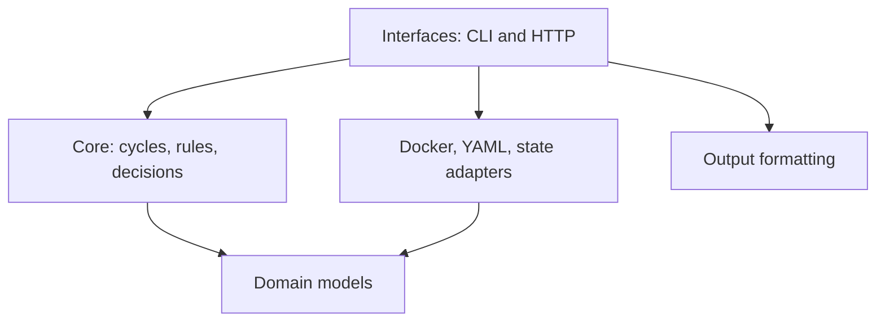

# Architecture

monit-docker is designed as a lightweight Community agent. Its core must stay
independent from the way it is invoked or observed so the same behavior can be
used from cron, a local HTTP server, or an external control plane.

## Dependency direction



The domain and core layers must not import CLI, HTTP, Prometheus, Docker SDK,
or product-specific code. Interfaces and adapters may depend on the core.

## Community boundary

The Community repository owns the single-host agent:

- one-shot execution suitable for cron;
- local monitoring and remediation rules;
- local state required for safe delays and cooldowns;
- a versioned status API, an opt-in manual action API and an optional separate lightweight UI;
- Prometheus exposition.

These capabilities must remain usable without a remote service or account.

## External control-plane boundary

A future multi-host product is a separate process and repository. It consumes
the agent's documented, versioned HTTP API instead of importing private agent
modules. Multi-host inventory, long-term history, teams, audit, SSO, advanced
notifications, and fleet-wide rule management belong to that control plane.

There must be no `if premium` branches in the Community engine. Commercial
features are separated by deployment boundary and protocol, not scattered
feature flags.

## Compatibility rules

1. Existing CLI commands and exit codes remain stable.
2. Domain objects use explicit, validated fields; wire formats will be versioned separately.
3. Raw measurements use base units (bytes, seconds, percentages).
4. Human-readable formatting belongs to output adapters.
5. Docker SDK objects never cross the adapter boundary.
6. New interfaces call the same one-shot engine used by cron.

## Incremental migration

The original application was a single executable. Refactoring is incremental:

1. package the CLI and retain the compatibility entry point — done;
2. extract domain models and pure metric calculations — done;
3. extract Docker collection and container selection adapters — done;
4. extract rule parsing, evaluation, and action execution — done;
5. introduce a one-shot engine API and use it from the CLI — done;
6. add cron safeguards and an optional HTTP interface — done;
7. document the initial read-only `/v1/status` protocol — done; external control plane — later.

## Current implementation and remaining work

`cli.py` now handles arguments, composition, presentation, PID files and exit
codes. `stats`, `monit`, `cron` and `serve` call `MonitoringEngine.run_once()`.

- `core/engine.py` coordinates a cycle and preserves the two-phase rule order.
- `core/rules.py` evaluates conditions against snapshots, without Docker or CLI imports.
- `core/policy.py` identifies resolved rules and requests cooldown reservations through a state interface.
- `adapters/configuration.py` renders the existing YAML/Mako configuration and imports.
- `adapters/rules.py` converts legacy syntax, aliases and byte units into rule values.
- `adapters/selection.py` compiles container groups and selectors.
- `adapters/docker.py` owns Docker connections, objects, streams and action execution.
- `adapters/state.py` owns the Unix process lock and atomic JSON state storage.
- `domain/` contains snapshots, normalized rule values, cycle results and application errors.
- `outputs/formatting.py` formats human-readable units.
- `service.py` schedules sequential cycles and owns a synchronized in-memory cache.
- `adapters/http.py` reads that cache and authenticates bounded manual submissions.
- `outputs/prometheus.py` renders cached values using Prometheus text exposition.

Core and domain have no third-party dependencies. Docker SDK objects never
leave their adapter. Missing or unrequested measurements remain `None`; raw
CPU values can exceed 100%. None of these internal models freezes an HTTP wire
format.

## Using the engine without the CLI

```python
from monit_docker.adapters.docker import DockerCollector, DockerActionExecutor, client_factory
from monit_docker.adapters.selection import ContainerSelector
from monit_docker.core import MonitoringEngine

selector = ContainerSelector(selectors={'name': ['web*']})
collector = DockerCollector(client_factory({}, from_env=True), selector)
engine = MonitoringEngine(collector, DockerActionExecutor(collector))

first = engine.run_once(resources=('cpu_percent', 'mem_percent'))
second = engine.run_once(resources=('cpu_percent', 'mem_percent'))
for snapshot in second.snapshots:
    print(snapshot.to_dict())
```

For configured rules, render `Configuration(path).load()`, construct a
`RuleParser(config.get('commands'), config.get('conditions'))`, parse expressions
with `parser.parse(expression)`, then pass a tuple of rules to `run_once(rules=...)`.
Parsing and validating selected expressions precedes connection and actions in
the CLI. Rule execution uses the same engine as collection.

An engine exclusively owns its collector and executor; do not share a collector
between engines. Collectors implement `begin_cycle()`, `select()`,
`describe(id, snapshot=None)`, `collect(snapshot, resources)` and `end_cycle()`.
Executors implement `execute(container_id, action) -> bool`. Descriptions and
collection return `ContainerSnapshot` values. These small duck-typed interfaces
allow test doubles and future adapters without importing infrastructure into core.

Each call creates a connection, lists containers again and uses fresh sampling
baselines. Statistics streams close immediately after sampling, before rule
actions; the client closes when the cycle ends, including early exits and
failures. Cleanup errors are reported, but never replace an existing cycle error.
Sequential calls are supported. Overlapping calls on the same engine are
rejected. The `cron` interface additionally holds a cross-process lock through
`LocalState` for the whole cycle; the engine itself owns no filesystem lock.

`run_once()` returns `CycleResult(snapshots, actions)`. Rules using only PID/status
run first; rules needing metrics run after sampling, in their original order
within each phase. Stopped containers skip metric rules. By default, rule cycles
collect only measurements those rules require; explicit `resources` adds
measurements. Collection without rules defaults to all resources. An optional
`on_snapshot` callback receives completed containers in order and allows the CLI
to preserve its first-container exit behavior. Its exceptions still trigger cleanup.

`run_once(..., dry_run=True)` evaluates and reports matching actions but never
calls the executor; `CycleResult.actions` includes only successful executions.
The optional `on_action` callback receives an `ActionDecision(container_id, rule,
command, status)` for each skipped, simulated or successful action. Its exceptions
abort the cycle with normal cleanup. Decisions use `pending`, `cooldown`, `restart-limit`, `dry-run` or
`executed` statuses and are internal values, not a frozen HTTP protocol.

An optional policy exposes `claim(container_id, rule, read_only=False) -> bool`.
The engine calls it once per eligible matching rule before the first action.
An optional `observe(container_id, rule, matched, read_only=False) -> bool` hook
sees true and false evaluations and can keep matching rules pending. Policies
with only `claim` remain supported. The CLI
composes a per-cycle `RestartPolicy` extending `TriggerPolicy` and `CooldownPolicy`
with a locked `LocalState`;
the cooldown policy depends only on `reserve(key, now, seconds, read_only=False) -> bool`
and an injectable clock. Identity serialization happens for all selected rules
before the cycle. The state adapter records the cooldown durably before allowing
execution. Failed or interrupted rule sequences retain their reservation, while
dry runs simulate reservations in memory only. No persistence code or product
flags enter the engine. `TriggerPolicy` additionally uses `observations` and
`replace_observations` on the state interface; it clears durable tracking before
collection and restores only observed true conditions. Trigger timing and
cooldown identity remain separate. See [trigger delay semantics](trigger-delay.md)
for reset, partial failure, preview and state migration behavior. See [cron semantics](cron.md) for retries and limits.

`RestartPolicy.permits(id, rule)` checks the whole resolved sequence against a
shared per-container restart budget before any rule side effects. Its
`claim_action(id, action, read_only=False)` hook reserves each restart durably
before execution, and `decorate(snapshot)` adds the budget to the snapshot.
The explicit offline `restart-reset` command uses the same state lock and audit
journal; health transitions do not rearm the budget. See [restart limits](restart-limit.md).

The first failed action aborts the cycle with `MonitoringError(116, ...)`;
absence of containers uses 114, and an exhausted statistics stream without two
distinct samples uses 115. A failed cycle raises rather than returning a partial
`CycleResult`; already completed actions are not rolled back. Docker transport
exceptions propagate to the caller (the CLI retains its 170/180 exit mapping).

A completed container exec with a nonzero status raises `CommandExecutionError`,
a `MonitoringError` subclass whose agent `code` stays 116 and whose `exit_code`
holds the container command's status (1–255). The Docker adapter creates this
transport-neutral error; the engine propagates it after cleanup. Only the CLI
maps it to a process exit status when `--propagate-exit-code` is enabled. The
engine has no CLI-specific propagation flag, and Docker/configuration errors
keep their existing mapping. Invalid or unavailable exec statuses remain 116.

## Compatibility and validation

Collectors may implement `prepare_resources(resources)`. The engine calls this
optional hook before opening a cycle with the union of requested and rule
resources. The Docker collector uses it for one bounded event-history query
shared by all selected containers. Event-only rules run in the metadata phase,
including on stopped containers. Each cycle discards its event cache; manual
actions do not inherit a previous cycle's event probe. Runtime checks are opt-in
and do not change the default resource set. See [runtime checks](runtime-checks.md).

Existing CLI flags, text/JSON formatting, rule phase ordering, aliases, unit
conversion, multicore CPU values and exit mappings are preserved. Deliberate
lifecycle changes are:

- invalid selected rule syntax, unknown aliases and unsupported actions fail
  before any action, rather than allowing earlier commands to run;
- metadata-only reads avoid opening a statistics stream;
- incomplete statistics streams report 115 instead of silently succeeding;
- invalid non-mapping configuration reports 110;
- resources are released deterministically, including on errors.

The historical operand order for chained numeric conditions is preserved during
this extraction. No change to memory accounting or rule comparison semantics is
included.

Tests cover repeated cycles, replacement containers, selectors, configuration
imports, rule semantics, action failure, stream exhaustion and cleanup. Core and
domain are imported without site-packages. Packaging tests rebuild and install
from the source distribution. An opt-in Docker integration suite runs on the
Python 3.12 CI job, creating and removing its own containers to test sampling,
actions, repeat calls and replacement. Docker-image tests run the isolated suite
and skip source-only packaging and opt-in integration tests.

The serve scheduler waits after each cycle and never overlaps cycles. HTTP
requests do not enter the engine. Success atomically replaces the cache; failures
and stale data remove exposed container measurements. Readiness uses monotonic
age, while API timestamps use wall time. Cooldown storage remains a separate
adapter, acquired per cycle. Metrics history is delegated to Prometheus.
The initial read-only API is documented in [serve.md](serve.md); internal domain
types remain private. Grafana dashboards consume metrics rather than Python imports.

`check-config` now composes an opt-in checked configuration loader, the existing
selector and rule parsers, and offline condition checks. It bypasses runtime/log
initialization and Docker client construction; text/JSON diagnostics are owned by
the CLI. See [configuration validation](check-config.md).

Still pending: a cycle-wide deadline and an embedded UI. A client timeout can be configured through existing
client settings; it is not an overall cycle deadline. Configuration is fixed for
each constructed CLI command; automatic reload is not added.
Legacy Python versions advertised by the package are not exercised by the CI
matrix, which currently runs Python 3.10 and 3.12. Some advertised interpreters
cannot run the current code; the supported minimum remains to be reconciled with
the metadata. See the [configuration and CLI compatibility baseline](config-cli-contract.md).


## Optional UI and manual operations

`ui/` is a separate static frontend/Nginx image, excluded from the Python
package and agent image. It consumes only HTTP API v1 and does not import agent
modules. There is no JavaScript build or runtime dependency in the agent. Nginx
provides browser authentication and TLS; Prometheus scrapes the private agent
network directly. See [UI setup](ui.md).

`ManualActions` holds a bounded request queue and 32 in-memory results. The
HTTP adapter verifies a proxy secret, exact origin, method, content type and
body length before admission. `MonitorService` executes one pending operation
between cycles, using the same operation mutex as collection. The engine's
manual method reselects an exact container ID and checks the supported action
vocabulary, including optional maintenance and restart-budget rearm. CLI
composition supplies the state-backed reservation function;
core/domain code has no HTTP, authentication, UI or storage imports.

Manual cooldowns use a distinct per-container key across the manual commands;
they do not replace rule cooldowns. The separate persistent audit journal records
action attribution and outcomes. An operation reserves
before execution and invalidates cached measurements. The subsequent collection
refreshes the cache. Autonomous rules remain enabled and can reverse a manual
operation unless automatic actions are suspended by temporary maintenance. The
queue does not promise exactly-once execution across process restarts.

The component is Community-only single-host software. A future commercial
control plane is still a separate process/product for fleet management, teams
and long-term history; it must use the versioned protocol as well.
