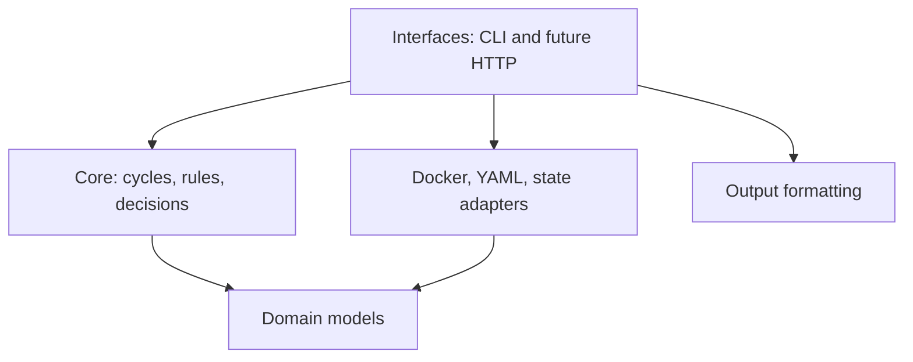

# Architecture

monit-docker is designed as a lightweight Community agent. Its core must stay
independent from the way it is invoked or observed so the same behavior can be
used from cron, a local HTTP server, or an external control plane.

## Dependency direction



The domain and core layers must not import CLI, HTTP, Prometheus, Docker SDK,
or product-specific code. Interfaces and adapters may depend on the core.

## Community boundary

The Community repository owns the single-host agent:

- one-shot execution suitable for cron;
- local monitoring and remediation rules;
- local state required for safe delays and cooldowns;
- a future lightweight read-only UI and versioned HTTP API;
- Prometheus exposition.

These capabilities must remain usable without a remote service or account.

## External control-plane boundary

A future multi-host product is a separate process and repository. It consumes
the agent's documented, versioned HTTP API instead of importing private agent
modules. Multi-host inventory, long-term history, teams, audit, SSO, advanced
notifications, and fleet-wide rule management belong to that control plane.

There must be no `if premium` branches in the Community engine. Commercial
features are separated by deployment boundary and protocol, not scattered
feature flags.

## Compatibility rules

1. Existing CLI commands and exit codes remain stable.
2. Domain objects use explicit, validated fields; wire formats will be versioned separately.
3. Raw measurements use base units (bytes, seconds, percentages).
4. Human-readable formatting belongs to output adapters.
5. Docker SDK objects never cross the adapter boundary.
6. New interfaces call the same one-shot engine used by cron.

## Incremental migration

The original application was a single executable. Refactoring is incremental:

1. package the CLI and retain the compatibility entry point — done;
2. extract domain models and pure metric calculations — done;
3. extract Docker collection and container selection adapters — done;
4. extract rule parsing, evaluation, and action execution — done;
5. introduce a one-shot engine API and use it from the CLI — done;
6. add cron safeguards and an optional HTTP interface — next;
7. freeze the first `/v1` agent protocol before building a control plane — later.

## Current implementation and remaining work

`cli.py` now handles arguments, composition, presentation, PID files and exit
codes. Both `stats` and `monit` call `MonitoringEngine.run_once()`.

- `core/engine.py` coordinates a cycle and preserves the two-phase rule order.
- `core/rules.py` evaluates conditions against snapshots, without Docker or CLI imports.
- `adapters/configuration.py` renders the existing YAML/Mako configuration and imports.
- `adapters/rules.py` converts legacy syntax, aliases and byte units into rule values.
- `adapters/selection.py` compiles container groups and selectors.
- `adapters/docker.py` owns Docker connections, objects, streams and action execution.
- `domain/` contains snapshots, normalized rule values, cycle results and application errors.
- `outputs/formatting.py` formats human-readable units.

Core and domain have no third-party dependencies. Docker SDK objects never
leave their adapter. Missing or unrequested measurements remain `None`; raw
CPU values can exceed 100%. None of these internal models freezes an HTTP wire
format.

## Using the engine without the CLI

```python
from monit_docker.adapters.docker import DockerCollector, DockerActionExecutor, client_factory
from monit_docker.adapters.selection import ContainerSelector
from monit_docker.core import MonitoringEngine

selector = ContainerSelector(selectors={'name': ['web*']})
collector = DockerCollector(client_factory({}, from_env=True), selector)
engine = MonitoringEngine(collector, DockerActionExecutor(collector))

first = engine.run_once(resources=('cpu_percent', 'mem_percent'))
second = engine.run_once(resources=('cpu_percent', 'mem_percent'))
for snapshot in second.snapshots:
    print(snapshot.to_dict())
```

For configured rules, render `Configuration(path).load()`, construct a
`RuleParser(config.get('commands'), config.get('conditions'))`, parse expressions
with `parser.parse(expression)`, then pass a tuple of rules to `run_once(rules=...)`.
Parsing and validating selected expressions precedes connection and actions in
the CLI. Rule execution uses the same engine as collection.

An engine exclusively owns its collector and executor; do not share a collector
between engines. Collectors implement `begin_cycle()`, `select()`,
`describe(id, snapshot=None)`, `collect(snapshot, resources)` and `end_cycle()`.
Executors implement `execute(container_id, action) -> bool`. Descriptions and
collection return `ContainerSnapshot` values. These small duck-typed interfaces
allow test doubles and future adapters without importing infrastructure into core.

Each call creates a connection, lists containers again and uses fresh sampling
baselines. Statistics streams close immediately after sampling, before rule
actions; the client closes when the cycle ends, including early exits and
failures. Cleanup errors are reported, but never replace an existing cycle error.
Sequential calls are supported. Overlapping calls on the same engine are
rejected; this is not a process-wide cron lock.

`run_once()` returns `CycleResult(snapshots, actions)`. Rules using only PID/status
run first; rules needing metrics run after sampling, in their original order
within each phase. Stopped containers skip metric rules. By default, rule cycles
collect only measurements those rules require; explicit `resources` adds
measurements. Collection without rules defaults to all resources. An optional
`on_snapshot` callback receives completed containers in order and allows the CLI
to preserve its first-container exit behavior. Its exceptions still trigger cleanup.

The first failed action aborts the cycle with `MonitoringError(116, ...)`;
absence of containers uses 114, and an exhausted statistics stream without two
distinct samples uses 115. A failed cycle raises rather than returning a partial
`CycleResult`; already completed actions are not rolled back. Docker transport
exceptions propagate to the caller (the CLI retains its 170/180 exit mapping).

## Compatibility and validation

Existing CLI flags, text/JSON formatting, rule phase ordering, aliases, unit
conversion, multicore CPU values and exit mappings are preserved. Deliberate
lifecycle changes are:

- invalid selected rule syntax, unknown aliases and unsupported actions fail
  before any action, rather than allowing earlier commands to run;
- metadata-only reads avoid opening a statistics stream;
- incomplete statistics streams report 115 instead of silently succeeding;
- invalid non-mapping configuration reports 110;
- resources are released deterministically, including on errors.

The historical operand order for chained numeric conditions is preserved during
this extraction. No change to memory accounting or rule comparison semantics is
included.

Tests cover repeated cycles, replacement containers, selectors, configuration
imports, rule semantics, action failure, stream exhaustion and cleanup. Core and
domain are imported without site-packages. Packaging tests rebuild and install
from the source distribution. An opt-in Docker integration suite runs on the
Python 3.12 CI job, creating and removing its own containers to test sampling,
actions, repeat calls and replacement. Docker-image tests run the isolated suite
and skip source-only packaging and opt-in integration tests.

Still pending: cross-process locking, dry-run/config-check commands, persisted
delays/cooldowns, a cycle-wide deadline, the `serve` command, HTTP API, Prometheus
exposition and a UI. A client timeout can be configured through existing client
settings; it is not an overall cycle deadline. Configuration is fixed for each
constructed CLI command; automatic reload and server scheduling are not added.
Legacy Python versions advertised by the package are not exercised by the CI
matrix, which currently runs Python 3.10 and 3.12.
