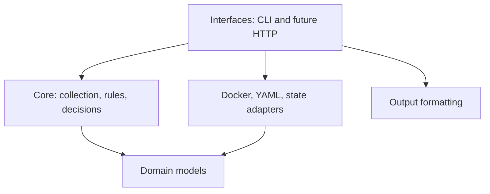

# Architecture

monit-docker is designed as a lightweight Community agent. Its core must stay
independent from the way it is invoked or observed so the same behavior can be
used from cron, a local HTTP server, or an external control plane.

## Dependency direction

The domain and core layers must not import CLI, HTTP, Prometheus, Docker SDK,
or product-specific code. Interfaces and adapters may depend on the core.

## Community boundary

The Community repository owns the single-host agent:

- one-shot execution suitable for cron;
- local monitoring and remediation rules;
- local state required for safe delays and cooldowns;
- a future lightweight read-only UI and versioned HTTP API;
- Prometheus exposition.

These capabilities must remain usable without a remote service or account.

## External control-plane boundary

A future multi-host product is a separate process and repository. It consumes
the agent's documented, versioned HTTP API instead of importing private agent
modules. Multi-host inventory, long-term history, teams, audit, SSO, advanced
notifications, and fleet-wide rule management belong to that control plane.

There must be no `if premium` branches in the Community engine. Commercial
features are separated by deployment boundary and protocol, not scattered
feature flags.

## Compatibility rules

1. Existing CLI commands and exit codes remain stable.
2. Domain objects use explicit, validated fields; wire formats will be versioned separately.
3. Raw measurements use base units (bytes, seconds, percentages).
4. Human-readable formatting belongs to output adapters.
5. Docker SDK objects never cross the adapter boundary.
6. New interfaces call the same one-shot engine used by cron.

## Incremental migration

The original application was a single executable. Refactoring is intentionally
incremental to keep existing users safe:

1. package the existing CLI and retain the compatibility entry point;
2. extract domain models and pure metric calculations;
3. extract Docker collection and container selection adapters;
4. extract rule parsing, evaluation, and action execution;
5. introduce a one-shot engine API;
6. build cron and HTTP interfaces on that API;
7. freeze the first `/v1` agent protocol before building a control plane.

## Current implementation and remaining work

This is a foundation, not a completed engine extraction. `cli.py` still owns
Docker access, configuration parsing, rules and execution. The raw metric
calculator and domain model have no third-party dependencies. Legacy unit
formatting lives in `outputs/formatting.py`, and CLI statistics now pass through
an immutable, type-validated `ContainerSnapshot` before presentation. Missing
measurements remain `None`; this internal model is not yet a public API contract.

Container groups, action aliases, condition aliases and parsed-expression
caches belong to individual command instances. This prevents cross-command
configuration leakage, but does not make existing command objects reusable or
thread-safe. In particular, Docker sampling and container caches still need a
cycle lifecycle before `run_once()` or a permanent server can be introduced.

Core/domain tests also run without site-packages. Packaging tests build and
install a wheel from the source distribution in a temporary directory and check
the release version target. Docker-image tests skip source-only packaging tests.
