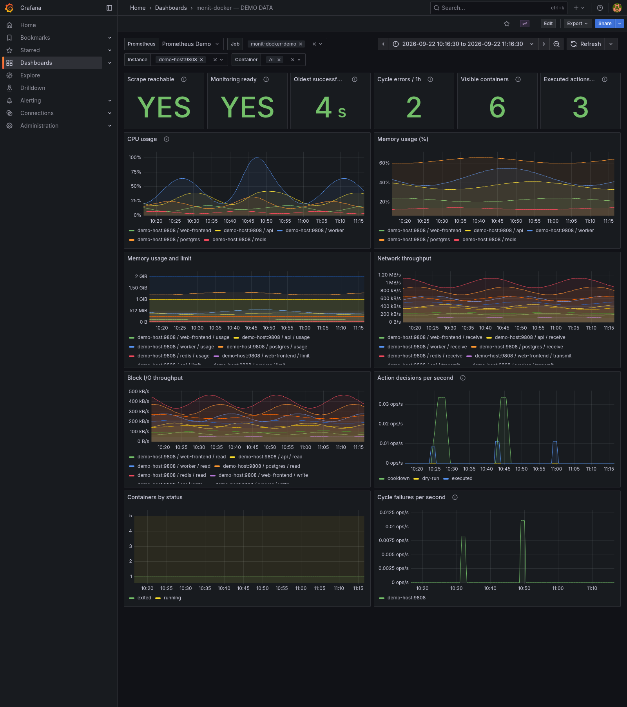
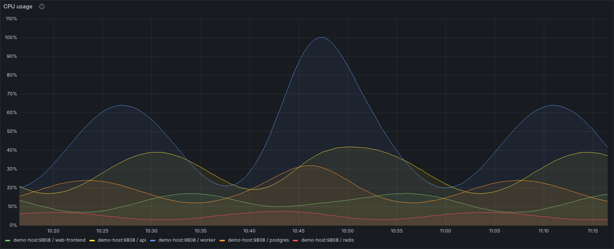
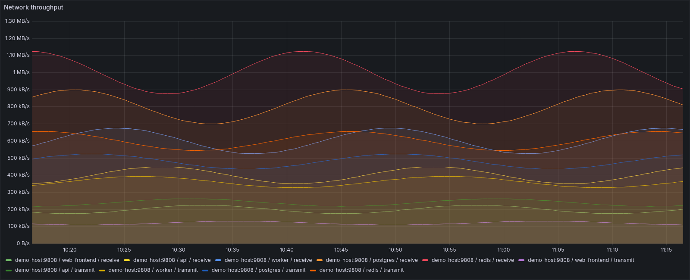

# Grafana example dashboard

Import [examples/grafana/monit-docker.json](https://github.com/decryptus/monit-docker/blob/master/examples/grafana/monit-docker.json)
to visualize the [documented metrics](metrics.md). This is a Classic JSON model
dashboard with built-in stat/time-series panels; it needs no Grafana plugins.
The JSON is included in the repository and source distribution.

Starting from scratch? The [Docker Compose quickstart](compose.md) configures
serve, Prometheus and this dashboard together. Use the manual import below when
you already have Prometheus and Grafana.

## Preview

These are real Grafana 12.2.0 renders of the example dashboard, using **synthetic
demonstration data** for six fictional containers. They are not production
measurements or performance benchmarks. Five containers have resource samples;
the stopped `backup` container appears only in the status/count panels.

CPU detail, showing the fictional containers over one hour:

Network receive/transmit throughput from synthetic byte counters:

## Prerequisites and import

1. Start `monit-docker serve` and configure Prometheus to scrape `/metrics`, as
   shown in [metrics.md](metrics.md). Wait for at least one successful cycle.
2. Add that Prometheus instance as a Grafana data source. Its configured scrape
   interval should match the actual Prometheus scrape interval (30 seconds in the
   example); Grafana uses it when expanding `$__rate_interval`.
3. In Grafana, open **Dashboards > New > Import**, upload `monit-docker.json`,
   choose a folder/title and import it. See the
   [official import instructions](https://grafana.com/docs/grafana/latest/visualizations/dashboards/build-dashboards/import-dashboards/).
4. Select your **Prometheus** data source in the dashboard's variable selector,
   then select **Job**, **Instance** and **Container**. These support multiple
   values and an All option. No deployment-specific datasource UID or host is
   embedded in the file.

The dashboard uses the documented
[Classic dashboard JSON model](https://grafana.com/docs/grafana/latest/visualizations/dashboards/build-dashboards/view-dashboard-json-model/).
It is an example, not an installed dashboard in your Grafana account. Importing
it creates no alert rules, notification channels or infrastructure.

## Panels

| Panel | What it shows |
| --- | --- |
| Scrape reachable | YES only when every selected Prometheus target reports `up = 1` |
| Monitoring ready | Fresh successful monitoring across all selected targets; unreachable targets count as unready |
| Oldest successful cycle | Largest age of a last successful cycle, in seconds |
| Cycle errors / 1h | Estimated failed-cycle count over the last hour |
| Visible containers | Number of currently exposed containers matching the filters |
| Executed actions / 1h | Estimated successful-action count over the last hour |
| CPU usage | Per-container percentage; can exceed 100 on multicore hosts |
| Memory usage (%) | Per-container memory percentage |
| Memory usage and limit | Per-container usage and reported limit, in bytes |
| Network throughput | Received/transmitted bytes per second using `rate()` |
| Block I/O throughput | Read/written bytes per second using `rate()` |
| Action decisions per second | Rates of executed, cooldown-skipped, pending and dry-run decisions |
| Containers by status | Counts grouped by Docker status |
| Cycle failures per second | Per-agent failure rate |

The dashboard starts with a one-hour range and refreshes every 30 seconds.
Agent panels use Job and Instance; they intentionally ignore the Container filter
because the corresponding metrics have no container labels. Container panels use
all filters. Rate/increase queries need multiple scrape samples and can initially
show **No data**. `increase()` is extrapolated and can show fractional counts.

No data is not equivalent to zero or healthy. Missing/stale container samples
produce gaps, not joined lines or fabricated zeros. Check the two health panels
before interpreting resource charts. The Container selector depends on observed
container-info series; new containers become selectable after a successful scrape.
The Job selector similarly needs the agent to have emitted readiness at least once.

Grafana queries Prometheus history; restarting monit-docker clears its in-memory
cache but does not delete that history. Container restarts can reset byte counters;
`rate()` handles those resets. Names and replacement IDs create new time series.

## Regenerate the screenshots

In the repository's GitHub **Actions**, run **Grafana screenshots**, then download
the `grafana-screenshots` artifact. The workflow also runs on pull requests that
change the dashboard or capture generator. It starts disposable Prometheus,
Grafana and [Grafana Image Renderer](https://grafana.com/docs/grafana/latest/setup-grafana/image-rendering/)
containers, validates every panel query, and exports three PNGs. It uses generated
history only and never connects to a user's Docker daemon or monitoring system.

The source dashboard's queries and panel layout are preserved. A separate demo
copy sets the title, time range and data source selection. Review new images
before replacing `docs/images/grafana-*.png`; the workflow does not commit files.
