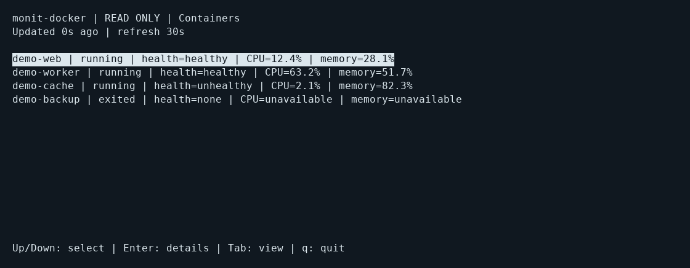
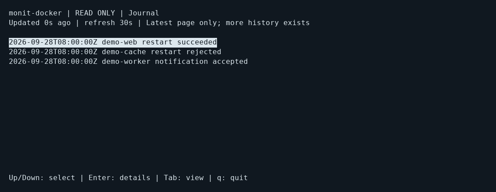
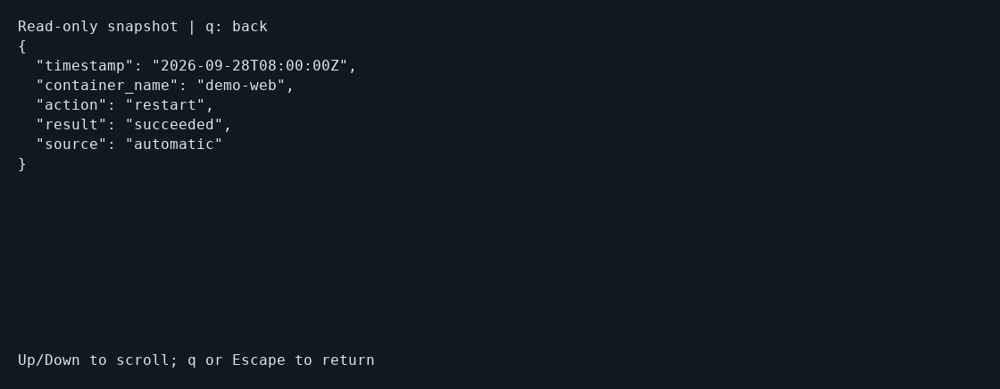

# Read-only terminal interface

The explicit `monit-docker tui` command provides a local curses view over the
same collection engine as `stats`. It does not require a running HTTP server.
Introduced in 0.0.82. Real Docker/PTY acceptance is automated; SSH acceptance and prolonged observation
remain open field-validation work; see the [1.0.0 limits](release-1.0.0.md).

```sh
monit-docker tui
monit-docker --name web tui --refresh 30
monit-docker -c /etc/monit-docker/monit-docker.yml \
  --audit-file /var/lib/monit-docker/audit/events.jsonl tui
monit-docker -c /etc/monit-docker/monit-docker.yml tui \
  --rsc health --rsc 'disk_percent[data]' --rsc 'inode_percent[data]'
```

Global configuration, client and selector options precede `tui`. `--rsc` selects
measurements as in `stats`; configured filesystem/access probes retain their
existing prerequisites and may execute read-only inspection commands inside a
container. This interface does not evaluate action rules or mutate restart,
maintenance or cooldown state. It does not show the live rule engine's decisions;
use the journal for recorded actions. Access to the Docker socket still conveys
its usual privileges: the read-only UI is not a Docker authorization boundary.

Use Up/Down to select an entry, Enter for its scrollable details, Tab to switch
between containers and journal, and `q` or Escape to return/quit. `c` and `j`
select containers and journal directly. Details are a fixed snapshot; return to
the list for updated values. Labels and errors remain in English.

Only this explicit command imports curses. All existing CLI and cron commands
retain their non-interactive behavior, outputs and exit codes, even on a TTY.
Pipes, cron without a TTY, missing TERM and missing curses support are rejected
with exit code 2 before constructing a Docker client. Ctrl-C returns 130. SIGHUP and SIGTERM unwind curses and return 129 and 143;
the previous signal handlers are restored. SIGKILL cannot run cleanup.

Collection runs sequentially in one worker, with a delay after each completed
cycle (30 seconds by default, configurable from 5 to 3600 seconds). Navigation
never starts additional collection requests. A slow Docker request cannot block
the terminal input loop; quitting stops future cycles without waiting indefinitely
for an in-flight read. The daemon worker may finish that read while the process
exits; this is a standalone command, not an embeddable thread lifecycle API.

Failed collection clears the measurements and displays an error. Measurements
older than max(90 seconds, three refresh intervals) are hidden as stale. Unavailable
values remain null in details. Resize is supported, including small terminals.

The journal is enabled only with an explicit `--audit-file` (or its existing
environment variable). Select the agent's actual journal path; no state path is
inferred by this command. It displays only the latest bounded page, with an
explicit indication when older history exists. It uses the shared audit reader's
locking, byte and record limits; a lock file may be created, but journal contents
are not modified. Busy/unavailable reads are labeled as errors and are retried
at the next normal refresh. Use `audit-export` for complete history.

The first version has no actions, configuration editor, history pagination or
rule editing. Those are outside this read-only milestone. SSH acceptance and
prolonged field observation remain separate from automated PTY tests and are
not certified by the 1.0 version number.

## Screenshots

These captures use the actual curses renderer in a pseudo-terminal with synthetic
containers and events. They demonstrate presentation, not production measurements.







To reproduce from the repository root, install the documentation-only `pyte` and
`Pillow` packages, then run `python .github/scripts/capture-terminal.py` on Linux
with the DejaVu Sans Mono font installed. These are not application dependencies.

## Release acceptance

The regression workflow tests both the installed candidate and published 0.0.82
outside the checkout, using a disposable real Docker container and a PTY. It
checks live container collection, DWho details, small-terminal resizing, journal
navigation, clean exit and restoration of terminal attributes. It verifies that
inspection does not restart the container or modify journal contents, rejects
piped TUI launches and executes a non-interactive cron dry run.

Reproduce after installing the selected package and pulling `alpine:3.20`:
`MONIT_DOCKER_INTEGRATION=1 python -m unittest discover -s tests -p test_terminal_docker.py -v`.
This opt-in test creates and removes only its own disposable containers. It is a
PTY acceptance test, not an SSH connection test or a prolonged deployment soak.
Review the workflow result for the exact commit before treating acceptance as passed.
