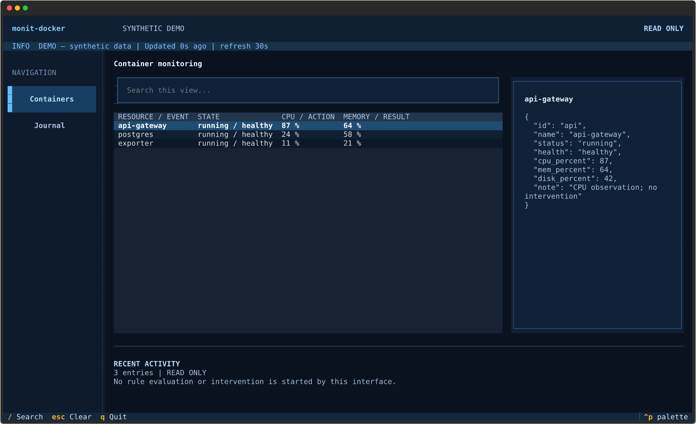
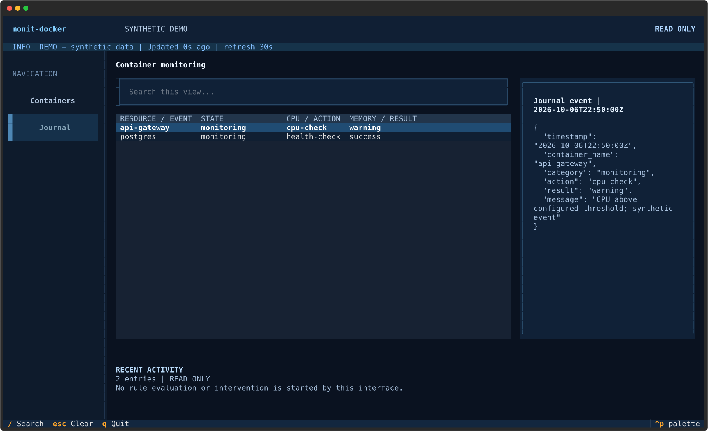
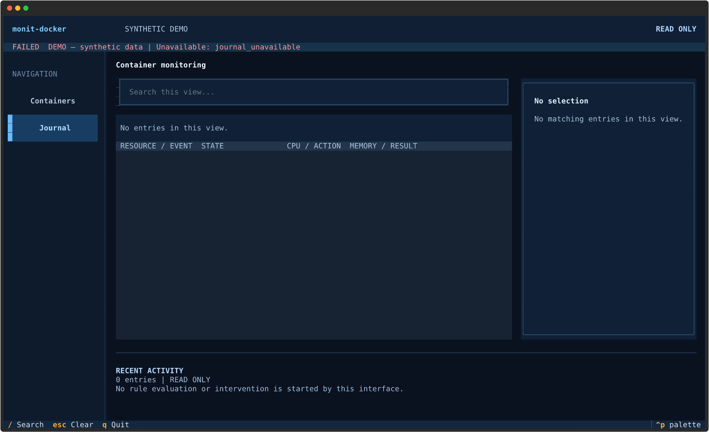

# Textual terminal interface

Install the optional terminal interface and select it explicitly. The existing curses interface remains available.

```sh
python -m pip install 'monit-docker[textual]'
monit-docker tui --ui textual
```

Containers and journal events share a searchable table and a scrollable detail panel. The existing Observation service retains its refresh interval, read-only collection and stale-data behavior. Docker selectors and `--rsc` remain unchanged. The journal uses `--audit-file` and shows the latest page, explicitly indicating whether older history exists. This interface does not execute remediation rules or manual actions.

`/` focuses search, Escape clears it, and `q` quits. Resize to at least 80 by
24; 120 columns or more gives the detail panel more room. States have explicit
text as well as color. An accepted or running request is not labelled successful.

## Offline demonstration

```sh
python -m monit_docker.textual_demo
```

This opens the actual interface with labelled synthetic fixtures. It connects
to no service and performs no operation. Screenshots generated from it are
demonstrations, not production observations or deployment evidence.

See the [contributor validation and media guide](textual-review.md) for tests and capture generation.

## Synthetic interface examples






