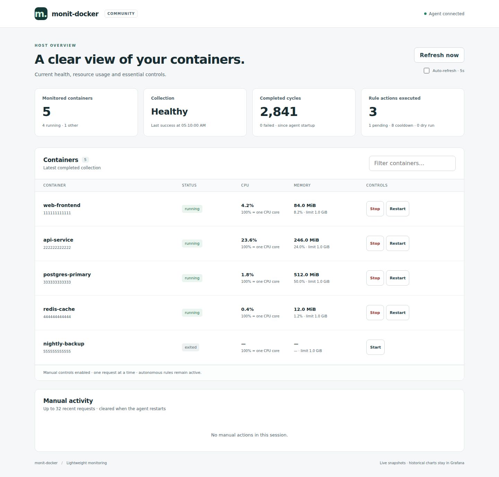
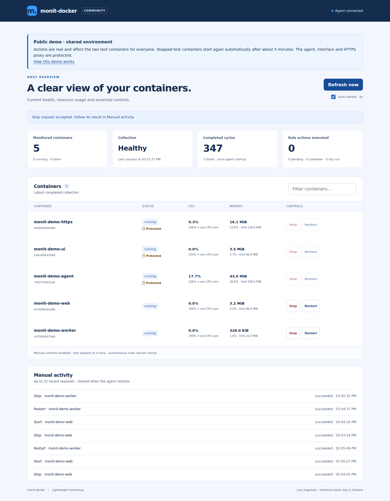

# monit-docker-ui

Optional Community interface for a single monit-docker agent. Static HTML, CSS
and JavaScript are served by Nginx, which also provides TLS, Basic authentication
and a same-origin API proxy. No frontend framework, CDN, font download, Node
runtime or compilation is needed. The UI image has no Docker socket access.

This component is packaged as its own Docker image, not installed into the
Python agent. It lives in the same repository for coordinated contract tests;
its only integration is HTTP API v1. Core/domain code never imports `ui/`.

See the [UI setup guide](../docs/ui.md) for read-only and opt-in action modes.
Build the image with `docker build -t monit-docker-ui:local ui` from the repository
root. The release pipeline builds and tests it separately, then publishes
`decryptus/monit-docker-ui:X.Y.Z` alongside the matching agent release. The first UI release is **0.0.63**.

The page supports existing API v1 agents in read-only mode when the optional
`manual_actions` capability is absent. Start/stop/restart require the new manual
action API. No route permits shell commands, deletion or configuration changes.
Containers with `manual_actions_protected: true` in their status remain visible
with a Protected lock and disabled controls. The agent enforces the corresponding
`monit-docker.protected` Docker label independently of the browser; automatic
rules remain active. See the [protection guide](../docs/ui.md#protect-a-container-from-manual-actions).

For development only, `ui/tests/browser.cjs` uses Playwright. CI installs the
test tool outside the component, checks multiple viewport sizes and captures
desktop/mobile screenshots using synthetic data. None of those dependencies or
fixtures are copied into the image.

## Journal readability

Since 0.0.71, journal events use contextual alert cards with English action
headings and reasons visible without expanding details. Success is green,
failure or rejection red, skipped actions yellow, queued work and notification
acceptance blue, work in progress purple (since 0.0.72), and simulations neutral. Every color has a visible text label.
Notification acceptance does not imply delivery to a person.

The presentation uses the existing CSS and JavaScript, without Bootstrap or
another runtime dependency. Raw fields remain in Event details and exports.

## Product boundary

This is a free, single-host Community UI. A future paid control plane remains
a separate product for multi-host management, teams and durable audit/history.
There are no premium flags or duplicated monitoring rules in this component.

## Screenshots

Synthetic demonstration data, rendered by the browser tests:

[Mobile overview](screenshots/mobile.png)

### Live public demo

The deployed demo shows real container metrics, a shared-environment banner and
three protected infrastructure containers. Stopped test fixtures are restored
after about five minutes. This timer belongs to the demonstration host, not the
UI image or agent defaults.

[Public demo on mobile](screenshots/demo-mobile.png)
